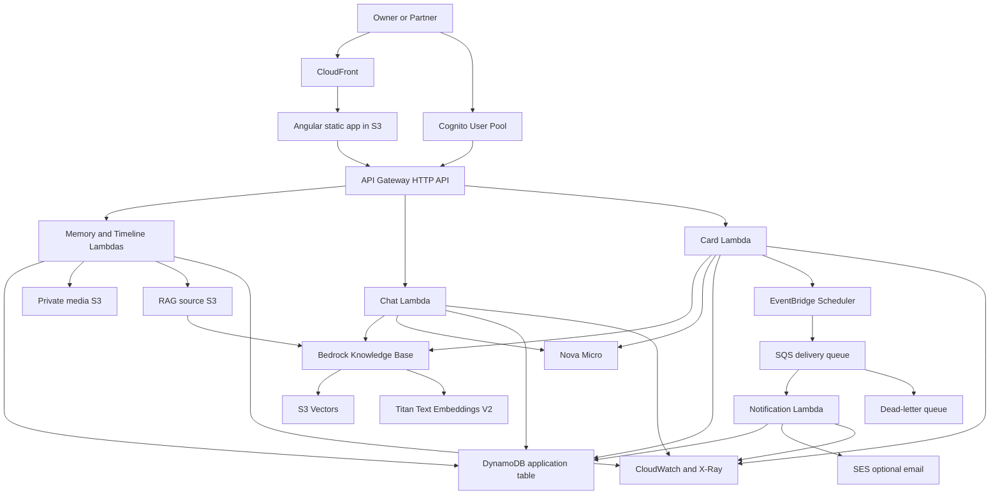

# Relationship RAG — Architecture and Delivery Blueprint

## 1. Product objective

Build a private, serverless web application for a couple that:

1. Presents their story as a visual timeline.
2. Lets authenticated users explore important moments through a grounded RAG chatbot.
3. Generates editable cards using selected memories and an intended tone.
4. Sends cards to an in-app inbox immediately or at a scheduled time.

The project is also a portfolio system intended to demonstrate TypeScript, Angular, AWS serverless architecture, Infrastructure as Code, event-driven design, RAG, security, observability, and disciplined automated testing.

## 2. Scope and principles

### Initial scope

- Exactly two invited users: `OWNER` and `PARTNER`.
- No public registration.
- Text memories, dates, tags, locations, and private photos.
- Chat answers grounded in supplied memories.
- Card generation, editing, preview, sending, and scheduled delivery.
- English and Spanish content supported from the beginning.
- Responsive web application, installable as a PWA later.

### Architectural principles

- Serverless and pay-per-use.
- Private by default.
- Infrastructure defined with AWS CDK and TypeScript.
- Small independently deployable Lambda functions grouped by feature.
- Domain logic remains independent from AWS SDK clients.
- Every generated answer must expose its supporting memory references.
- The model may transform known information but must not invent relationship facts.
- Features move to production only after automated quality gates pass.

## 3. Recommended technology stack

| Layer                      | Technology                                                            |
| -------------------------- | --------------------------------------------------------------------- |
| Frontend                   | Angular, standalone components, Signals, RxJS, Tailwind CSS           |
| API                        | Amazon API Gateway HTTP API                                           |
| Compute                    | AWS Lambda, Node.js, TypeScript                                       |
| Authentication             | Amazon Cognito User Pool with invite-only accounts                    |
| Structured storage         | Amazon DynamoDB, on-demand capacity                                   |
| Media and source documents | Private Amazon S3 buckets                                             |
| RAG orchestration          | Amazon Bedrock Knowledge Bases                                        |
| Vector storage             | Amazon S3 Vectors                                                     |
| Embeddings                 | Amazon Titan Text Embeddings V2                                       |
| Generation                 | Amazon Nova Micro; Nova Lite only if quality requires it              |
| Async delivery             | EventBridge Scheduler, SQS, Lambda, and a dead-letter queue           |
| Email notification         | Amazon SES, optional after the in-app inbox works                     |
| Infrastructure             | AWS CDK with TypeScript                                               |
| Validation/contracts       | Zod and OpenAPI                                                       |
| Unit/component tests       | Vitest and Angular Testing Library                                    |
| BDD and E2E                | Cucumber-style Gherkin specifications and Playwright                  |
| AWS integration tests      | Vitest, AWS SDK, deployed test stack, and DynamoDB Local where useful |
| CI/CD                      | GitHub Actions with AWS OIDC; no stored AWS access keys               |
| Observability              | CloudWatch Logs, metrics, dashboards, alarms, and X-Ray tracing       |

## 4. System architecture



## 5. Main runtime flows

### 5.1 Memory ingestion

1. Owner submits memory metadata and requests a presigned upload URL.
2. Browser uploads private photos directly to the media bucket.
3. Memory API validates ownership, metadata, MIME type, and file limits.
4. Structured metadata is stored in DynamoDB.
5. A normalized Markdown or JSON document is written to the RAG source bucket.
6. The Bedrock Knowledge Base syncs and creates embeddings.
7. Ingestion status changes from `PENDING` to `INDEXED` or `FAILED`.

### 5.2 Chat request

1. API Gateway validates the Cognito JWT.
2. Chat Lambda validates the request and conversation ownership.
3. The query is rewritten only when conversation context is required.
4. Knowledge Base retrieves the most relevant memory chunks.
5. Application applies a minimum relevance threshold and optional date/tag filters.
6. Nova Micro receives the system prompt, question, retrieved context, and allowed citation IDs.
7. Response is validated against a structured schema.
8. Answer, citations, token usage, latency, and safe diagnostic metadata are stored.
9. The frontend displays the answer with links to the referenced timeline moments.

If retrieval provides insufficient evidence, the assistant must state that the memory has not been provided instead of guessing.

### 5.3 Card generation and delivery

1. User selects tone, occasion, recipient, and optional memories.
2. Card Lambda retrieves relevant memory context.
3. Nova Micro produces a structured draft containing title, body, and cited memory IDs.
4. User edits and explicitly saves the draft.
5. User sends immediately or chooses a future delivery time.
6. Immediate cards enter the recipient's inbox; scheduled cards use EventBridge Scheduler.
7. Delivery processing is idempotent. Failed asynchronous deliveries go to the DLQ.

AI generation and card sending are separate actions. The model never sends a card by itself.

## 6. Infrastructure design

### CDK stacks

| Stack                | Main resources                                                                      |
| -------------------- | ----------------------------------------------------------------------------------- |
| `EdgeStack`          | CloudFront, frontend S3 bucket, Origin Access Control, optional Route 53/ACM        |
| `AuthStack`          | Cognito User Pool, app client, invite-only configuration, roles/groups              |
| `DataStack`          | DynamoDB table, media bucket, RAG source bucket, lifecycle policies, encryption     |
| `AiStack`            | Bedrock Knowledge Base, S3 vector index, embedding configuration, model permissions |
| `ApiStack`           | API Gateway, JWT authorizer, Lambda functions, IAM roles, API access logs           |
| `MessagingStack`     | EventBridge Scheduler roles, SQS queue, DLQ, notification Lambda, optional SES      |
| `ObservabilityStack` | Dashboards, alarms, log retention, tracing, budget notifications                    |

Use separate `dev`, `test`, and `prod` stages. Resource names and removal policies must be stage-aware. Production data resources use retain/protection policies; ephemeral test resources may be destroyed automatically.

### DynamoDB access model

Use a single application table initially, with explicit repository interfaces so it can be changed later without leaking DynamoDB details into the domain.

| Entity         | Partition key       | Sort key example                |
| -------------- | ------------------- | ------------------------------- |
| Couple profile | `COUPLE#<id>`       | `PROFILE`                       |
| Member         | `COUPLE#<id>`       | `MEMBER#<userId>`               |
| Memory         | `COUPLE#<id>`       | `MEMORY#<date>#<memoryId>`      |
| Card           | `COUPLE#<id>`       | `CARD#<createdAt>#<cardId>`     |
| Inbox item     | `USER#<userId>`     | `INBOX#<deliveryAt>#<cardId>`   |
| Conversation   | `USER#<userId>`     | `CONVERSATION#<updatedAt>#<id>` |
| Message        | `CONVERSATION#<id>` | `MESSAGE#<createdAt>#<id>`      |

Add GSIs only after defining a real access pattern. Likely indexes are cards by recipient/status and memories by ID. Avoid scans in application paths.

### API modules

```text
services/
  memories/
    domain/
    application/
    adapters/
    handlers/
  chat/
  cards/
  notifications/
packages/
  contracts/
  domain/
  observability/
  test-utils/
apps/
  web/
  infrastructure/
```

Each feature follows ports-and-adapters boundaries:

- Domain: entities, value objects, policies, and errors.
- Application: use cases and ports.
- Adapters: DynamoDB, S3, Bedrock, Scheduler, and SES implementations.
- Handlers: API Gateway or queue translation only.

## 7. API surface for the first release

```text
GET    /me
GET    /timeline
POST   /memories
GET    /memories/{memoryId}
PATCH  /memories/{memoryId}
POST   /memories/{memoryId}/uploads
POST   /memories/{memoryId}/index

POST   /conversations
GET    /conversations/{conversationId}
POST   /conversations/{conversationId}/messages

POST   /cards/generate
POST   /cards
PATCH  /cards/{cardId}
POST   /cards/{cardId}/send
GET    /inbox
PATCH  /inbox/{cardId}/read
```

All request and response schemas originate in `packages/contracts`, use Zod at runtime, and generate or verify the OpenAPI contract in CI.

## 8. Combined SDD, BDD, and TDD workflow

For this project, **SDD means specification-driven development**.

### Required order for every vertical feature

1. **SDD — Specify**
   - User outcome and non-goals.
   - Domain rules and invariants.
   - API request/response schema.
   - DynamoDB access patterns.
   - Authorization rules.
   - Failure states and observability requirements.

2. **BDD — Describe behavior**
   - Write Given/When/Then acceptance scenarios before implementation.
   - Include happy paths, permission failures, validation failures, retries, and empty states.
   - Product-level scenarios become Playwright or API acceptance tests.

3. **TDD — Implement**
   - Red: write one failing unit test for the smallest behavior.
   - Green: implement only enough code to pass.
   - Refactor: improve design while keeping all tests green.
   - Repeat at domain and application-service level.

4. **Integrate**
   - Run contract tests against real handlers.
   - Run AWS integration tests in the test stage.
   - Run end-to-end behavior tests through the deployed frontend and API.

5. **Evaluate**
   - Run the RAG golden dataset and quality thresholds.
   - Review cost, latency, logs, alarms, and security checks.

### Example feature specification

**Feature:** grounded question answering

**Invariant:** an answer cannot cite a memory outside the authenticated couple, and unsupported relationship facts are not presented as true.

```gherkin
Feature: Ask about a relationship memory

  Scenario: Answer from a known memory
    Given the memory "First trip to Puerto Vallarta" is indexed
    And I am authenticated as a member of the couple
    When I ask "Where did we take our first trip?"
    Then the answer mentions "Puerto Vallarta"
    And the answer cites "First trip to Puerto Vallarta"

  Scenario: Refuse to invent an unknown detail
    Given no indexed memory mentions our first concert
    When I ask "What was our first concert?"
    Then the assistant says that the information has not been provided
    And the answer contains no invented venue or artist

  Scenario: Prevent cross-couple access
    Given a memory belongs to another couple
    When I attempt to retrieve it
    Then the API returns 404
    And no memory metadata is returned
```

## 9. Automated test strategy

### Test pyramid

| Level          | What it verifies                                         | Tools                                            | Execution                                     |
| -------------- | -------------------------------------------------------- | ------------------------------------------------ | --------------------------------------------- |
| Static         | Types, formatting, linting, dependency rules             | TypeScript, ESLint                               | Every commit                                  |
| Unit           | Domain policies, use cases, mappers, prompt construction | Vitest                                           | Every commit                                  |
| Component      | Angular components, forms, state, accessibility          | Angular Testing Library, axe                     | Every pull request                            |
| Contract       | Zod/OpenAPI compatibility and handler responses          | Vitest, OpenAPI validation                       | Every pull request                            |
| Infrastructure | CDK resources, IAM boundaries, encryption and retention  | CDK assertions                                   | Every pull request                            |
| Integration    | DynamoDB, S3, Bedrock adapters, queues, scheduler        | Deployed test stack/AWS SDK                      | Pull request and main                         |
| BDD/E2E        | User-visible acceptance scenarios                        | Playwright                                       | Pull request preview/test stage               |
| RAG evaluation | Retrieval and grounded generation quality                | Golden dataset runner                            | Pull request for AI changes; nightly/full run |
| Security       | Dependency, secret, IaC, and authorization checks        | Dependabot/npm audit, secret scan, policy checks | Pull request and scheduled                    |

### What to mock

- Unit tests mock repository and model ports, not the AWS SDK globally.
- Handler tests mock application use cases.
- Integration tests use actual deployed AWS resources for critical paths.
- Bedrock tests use recorded deterministic fixtures for most PRs and a limited live-model suite for integration/evaluation.
- End-to-end tests never mock authentication or API behavior in the full test stage.

### RAG-specific evaluation

Maintain a versioned `rag-evals` dataset with questions, expected memory IDs, required facts, forbidden facts, and whether the correct response is an abstention.

Measure:

- Retrieval Recall@K.
- Mean Reciprocal Rank where useful.
- Citation precision.
- Required-fact coverage.
- Unsupported-claim rate.
- Correct abstention rate.
- Response-schema validity.
- Latency and token usage budgets.

Do not assert the complete generated sentence. Assert structured properties, cited sources, required facts, forbidden claims, and policy behavior. Any LLM-as-judge score is supplementary and cannot be the only release gate.

### Minimum quality gates

- Type checking, linting, and all deterministic tests pass.
- New domain/application code has meaningful branch coverage; target at least 80%, without treating coverage as proof of correctness.
- Every acceptance criterion has at least one automated scenario.
- No critical/high security finding is accepted silently.
- CDK diff is reviewed before production deployment.
- Critical RAG cases have 100% citation correctness and cross-tenant isolation.
- Failed asynchronous delivery is observable and recoverable from the DLQ.

## 10. Implementation and integration phases

### Phase 0 — Specifications and repository foundation

**Deliverables**

- Monorepo with Angular app, CDK app, Lambda packages, shared contracts, and test utilities.
- Architecture decision records for Angular, DynamoDB, RAG store, model, and authentication.
- Initial OpenAPI skeleton and domain glossary.
- CI pipeline for lint, type checks, unit tests, and CDK synth.
- `dev`, `test`, and `prod` stage configuration.

**Exit gate**

- Clean checkout installs, builds, tests, and synthesizes infrastructure.
- CI authenticates to AWS through OIDC without long-lived credentials.

### Phase 1 — Secure platform and authentication

**Deliverables**

- CloudFront-hosted Angular shell.
- Cognito invite-only authentication.
- API Gateway JWT authorizer.
- `/me` endpoint and Angular route guards.
- Owner/partner authorization policy.

**Tests**

- Unit tests for authorization policy.
- CDK assertions for blocked public S3 access and authorizer configuration.
- BDD scenarios for login, expired token, unauthenticated access, and invite-only registration.
- Playwright login and protected-route journey.

**Exit gate**

- Only the two invited identities can reach protected APIs and pages.

### Phase 2 — Story timeline and private media

**Deliverables**

- Memory CRUD and timeline queries.
- Presigned S3 photo uploads.
- Responsive story timeline and memory details.
- Ownership enforcement and safe media rendering.

**Tests**

- TDD for memory invariants and chronological ordering.
- Contract tests for memory endpoints.
- S3/DynamoDB integration tests.
- BDD scenarios for create, edit, view, invalid file, and unauthorized memory access.
- Playwright timeline journey.

**Exit gate**

- A user can create a complete memory and see it correctly ordered with private photos.

### Phase 3 — RAG ingestion pipeline

**Deliverables**

- Normalized memory document format.
- Source bucket and Bedrock Knowledge Base.
- S3 vector index and Titan embedding configuration.
- Index/reindex status and failure handling.
- Metadata filters for couple ID, date, category, and tags.

**Tests**

- Unit tests for document normalization and metadata generation.
- Integration test that indexes a fixture and retrieves it by semantic query.
- Isolation test proving another couple's content cannot be returned.
- BDD scenarios for successful indexing, reindexing, and failed ingestion.

**Exit gate**

- A known set of fixture questions retrieves the expected memories above the initial Recall@K threshold.

### Phase 4 — Grounded chatbot

**Deliverables**

- Conversation and message persistence.
- Retrieval orchestration, grounded prompt, structured answer, and citations.
- Chat UI with loading, retry, citations, and empty states.
- Guardrails for insufficient context and sensitive logging.

**Tests**

- TDD for orchestration, relevance thresholds, prompt input, and response validation.
- Contract tests for chat requests and structured responses.
- RAG golden dataset including known, ambiguous, and unknown questions.
- BDD/Playwright chat scenarios.
- Load and timeout test for expected personal usage.

**Exit gate**

- The chatbot answers known questions with correct citations, abstains on unknown facts, and never exposes another user's content.

### Phase 5 — Card studio

**Deliverables**

- Generate cards by occasion, tone, recipient, and selected memories.
- Structured generation response.
- Draft editing, saving, preview, and deletion.
- Clear separation between AI generation and user-approved sending.

**Tests**

- TDD for card state transitions and ownership.
- Contract tests for generation and persistence.
- BDD scenarios for generate, edit, regenerate, save, and reject draft.
- RAG evaluation for memory grounding and forbidden unsupported facts.
- Playwright card creation journey.

**Exit gate**

- Generated drafts use selected context, remain editable, and cannot be sent without explicit confirmation.

### Phase 6 — Inbox and scheduled delivery

**Deliverables**

- Immediate in-app delivery.
- Read/unread inbox.
- EventBridge scheduled delivery.
- SQS retry, idempotency key, DLQ, and optional SES notification.

**Tests**

- TDD for delivery state machine and idempotency.
- Integration tests for scheduler-to-queue-to-Lambda flow.
- Failure injection verifying retry and DLQ behavior.
- BDD scenarios for immediate, scheduled, duplicate, late, and failed delivery.
- Playwright inbox/read-state journey.

**Exit gate**

- A card is delivered exactly once at or after its scheduled time, and failures are recoverable.

### Phase 7 — Hardening, observability, and cost controls

**Deliverables**

- Structured logs with correlation IDs and redaction.
- CloudWatch dashboard and alarms for errors, latency, throttling, DLQ depth, and ingestion failures.
- X-Ray tracing for API paths.
- AWS Budget alerts.
- Backup, retention, restore, and incident runbooks.
- Accessibility and responsive-design review.

**Tests**

- Authorization regression suite.
- Restore drill for critical data.
- Alarm smoke tests.
- Accessibility checks.
- Performance and cost-budget tests.

**Exit gate**

- Failures are detectable, private data is not present in logs, restore steps are documented, and spend alerts are active.

### Phase 8 — Production release

**Deliverables**

- Custom domain and TLS if desired.
- Production Cognito users created through the invitation process.
- Initial real memories imported and reviewed.
- Full acceptance and RAG evaluation report.
- Tagged release and rollback instructions.

**Exit gate**

- All deterministic, integration, BDD, security, and RAG release gates pass against production-like data before launch.

## 11. CI/CD pipeline

### Pull request

1. Install from lockfile.
2. Format and lint check.
3. Type check.
4. Unit and component tests.
5. Contract and CDK assertion tests.
6. Build Angular and Lambda packages.
7. Security and secret checks.
8. Deploy/update isolated test stage when required.
9. Integration and Playwright BDD tests.
10. Limited live RAG evaluation when AI code, prompts, chunking, embeddings, or model settings change.
11. Publish test reports and CDK diff.

### Main branch

1. Repeat mandatory checks.
2. Deploy `dev` automatically.
3. Run smoke and integration tests.
4. Require approval for `prod`.
5. Deploy production through CDK.
6. Run read-only smoke tests and monitor alarms.

## 12. Definition of done for every feature

A feature is complete only when:

- Its specification and non-goals are recorded.
- Acceptance criteria exist as Given/When/Then scenarios.
- Domain and application behavior was implemented through TDD.
- API contracts and authorization rules are tested.
- Required AWS integration tests pass.
- Relevant Playwright journey passes.
- RAG-related changes pass the evaluation dataset.
- Logs, metrics, alarms, and failure handling exist.
- Documentation and architecture decisions are current.
- The deployed test-stage behavior matches the specification.

## 13. Recommended first development slice

Do not begin with the chatbot. The first vertical slice should be:

> An invited user signs in, creates one text-only memory, and sees it on the private timeline.

This slice validates the repository, CI/CD, Cognito, API Gateway, Lambda, DynamoDB, Angular authentication, contracts, CDK, and the complete SDD/BDD/TDD workflow before Bedrock is introduced.

After that slice is stable, add private photo upload, then RAG ingestion, and only then build chat generation.
